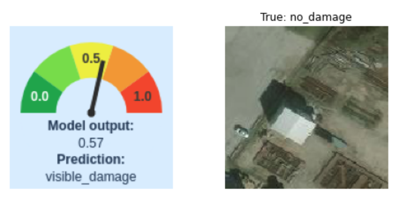
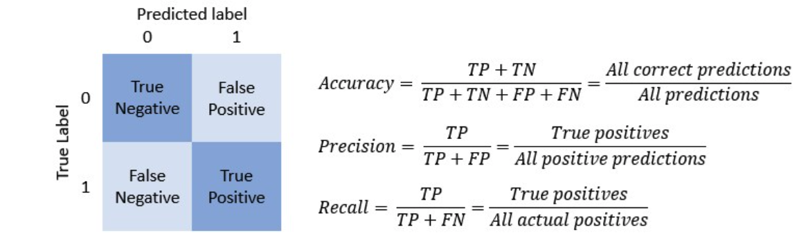
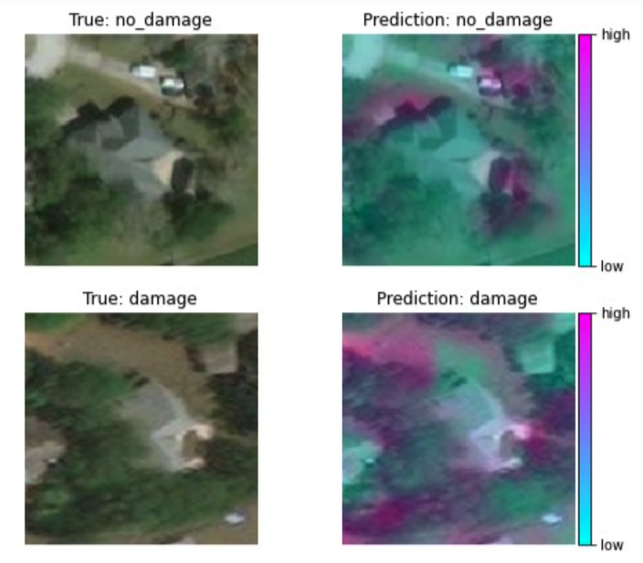

**1.** Below are listed some potential characteristics of a system trained to identify damage in overhead imagery. Identify those that apply to system you have built out in this project:
- [x] The system is trained to automatically recognize the presence of damage in a satellite image.
- [x] The system could be used to identify damage in an individual image as well as to quantify the overall amount of damage to a region.
- [ ] The system is set up to compare images taken before and after the disaster to determine the presence of damage.
- [ ] The system is likely to perform well on images taken from a new disaster scenario where damage is visible in overhead imagery.

**2.** In the design phase of this damage assessment project you performed data augmentation. What was the main purpose of using data augmentation in this case? Select all that apply
- [x] To increase the variety of satellite images in your training set by simulating realistic examples of images taken in different orientations or under different conditions.
- [ ] To generate a second dataset that you could use to evaluate the performance of your model.
- [ ] To evaluate the accuracy and other performance metrics of your model.

**3.** Which of the following are examples of why aerial imagery may be useful in disaster management? Select all that apply.
- [x] Aerial imagery can allow for a rapid assessment of where damage exists on the ground after a disaster.
- [x] Aerial imagery can provide a means of access and visibility into hard to reach or dangerous areas.
- [x] Aerial imagery can provide for an assessment or estimate of the total scope of damage to an area after a disaster.

**4.** What are some of the relative advantages and disadvantages of different modes of overhead imagery.
- [x] Planes can provide more targeted and often higher-resolution imagery than satellites but will tend to cover less area.
- [x] Small commercially available drones can be useful for gathering imagery very close to the ground and potentially from perspectives that would be inaccessible to planes or satellites.
- [x] Satellite imagery can cover a large area but may be relatively low resolution and may be obscured by cloud cover.

**5.** Which of the following was your problem statement for this damage assessment project?
- [ ] "Identifying damaged regions is crucial for disaster managers to coordinate response efforts effectively."
- [ ] "Disaster managers aim to evaluate the extent of damage and create recovery plans based on overhead imagery by using a convolutional neural network to classify images."
- [ ] "Disaster managers need to analyze aerial images to understand the impact of a disaster and devise strategies for recovery."
- [x] Disaster managers need to identify and assess damaged areas using large volumes of overhead imagery to prioritize response efforts, allocate resources, and plan for recovery and reconstruction activities.

**6.** What of the following is true regarding the use of Al for automatic damage assessment in overhead imagery vs. the use of expert human reviewers?
- [ ] Al systems are less subject to bias in their assessment of images than human reviewers
- [ ] Al systems are more accurate than human reviewers in that they can sometimes detect damage in images when even an expert human reviewer cannot.
- [x] While an Al system may not be as good as an expert human when it comes to reviewing individual images, Al systems can process large volumes of images quickly, which can help in response efforts.

**7.**

In the design lab for this project, you visualized the output of your model as a sort of "confidence meter", as well as a true vs. predicted label. Which of the following is true of the "confidence meter" output?
- [ ] A confidence meter output near 0.5 means the model has high confidence that some damage is present.
- [x] A confidence meter output near 1 means the model has high confidence that visible damage is present.
- [x] A confidence meter output near 0.5 means the model has low confidence and is not strongly indicating the presence or lack of visible damage.
- [x] A confidence meter output near 0 means the model has high confidence that no visible damage is present.

**8.** In many real-world damage assessment projects, you would be likely to be looking at many more images containing no damage than those containing damage. For the next two questions, imagine a scenario where you are training an Al system to do damage assessment using overhead imagery with a labeled dataset containing 99% images identified as showing no damage and only 1% images identified as showing damage.

Which of the following might be likely when it comes to training your classifier using this dataset?
- [ ] As long as you have enough examples of each class (damage and no damage) then the relative proportion of images showing damage or no damage is not relevant to the problem of training an Al model.
- [x] Using methods of upsampling and downsampling (seethe animal classification lab in course 2 of this specialization), as well as data augmentation, could help to balance the dataset and train a more robust model.
- [x] If you trained your model directly on this dataset, the model could learn to simply predict all images as containing "no damage" because in this way it might achieve a higher accuracy (99%) than any attempt to correctly identify those containing damage as well.
- [x] Collecting more images showing damage (if possible) would help balance the dataset and allow you to train a more robust model.

**9.**

With reference to the scenario described in the previous question, if you trained a model directly on the unbalanced dataset (99% of images labeled as "no damage" and 1% labeled as showing damage) and it learned to simply predict "no damage" in all cases, what would be true of the model performance metrics (accuracy, precision and recall) you looked at in these labs? You can assume that a "positive" in this case is the presence or detection of damage in an image.
- [x] Accuracy would be 99%, precision would be 0/0 or undefined, recall would be zero.
- [ ] Accuracy would be 1%, precision would be 99%, recall would be 99%.
- [ ] Accuracy would be 99%, precision would be 1/99, recall would be 1/99.

**10**

True or false: The visual output of the GradCAM method used in the lab displays areas of detected damage shown in a heatmap where light blue shows areas of low damage and pink shows areas of high damage.
- [ ] True
- [x] False
